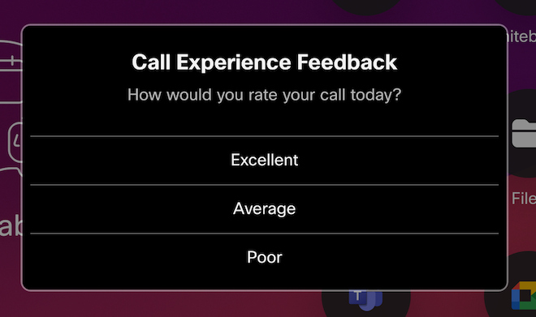

# Customer Satisfaction

 

Macro for showing a Customer Satisfaction survey after each call.

Allows data to be posted to a Webex Space, sent to a HTTP Server and/or an Incident raised in Service Now

Provides 4 simple questions
- Satisfaction (Excellent, Average, Poor)
- Issue (Audio/Video, Content Sharing, Other)
- Feedback
- Email Address (if provided, will link to Caller in SNOW)

Does not require all questions to be completed for data to be captured, any data entered will be used for processing.



## 🚨 Known Issues 🚨

Due to current limitations in RoomOS 11, this macro will not currently capture results if the user does not select/submit each dialog box

This macro is working successfully on RoomOS 10

## Prerequisites

The following items are needed, depending on the enabled services.

**Webex Space**
- A Webex Bot - create at [developer.webex.com](https://developer.webex.com/my-apps/new/bot) 
- An existing Webex Space with the Webex bot as a member.
- The RoomId of the destination Webex space. These example methods can be used to get the Room Id
  - Using the [List Rooms](https://developer.webex.com/docs/api/v1/rooms/list-rooms) Developer API
  - Adding `astronaut@webex.bot` to the space (bot will leave and 1:1 you the Id)
  - 1:1 Message `astronaut@webex.bot`, with an @Mention of the Space Name

**Service Now**
- A User account with the `sn_incident_write` permission
- The URL of your Service Now instance
- Credentials for the above user account, encoded in Base64 in the following format `username:password`

**HTTP JSON**
- A remote service capable of receiving HTTP POST messages.
- (Example) [CSV Server](https://github.com/jeremywillans/csv-server) can be used to test receiving messages and storing them in a CSV File
- The following format is used for the sent JSON Message
    ```
    { timestamp: 1662433280683, system: 'Test Endpoint', serial: 'FOC123456AA', software: 'ce10.19.1.1.cbd8b1e5d9e', rating: 'Average', destination: 'spark:123456789@webex.com', duration: 15, duration_fmt: '15 seconds',cause: 'LocalDisconnect', issue: 'Content/Sharing', feedback: 'Example feedback', reporter: 'user@example.com' }
    ```

## Deployment

1. Download the Macro file and upload to your Webex device.
2. Update the Parameters and Enabled Services, outlined at the top of the Macro
3. Make a test call! (noting the Call Duration value before the survey is displayed)

## Debugging

The macro contains two events for testing the Survey without the need to make outbound calls.

These can be invoked by creating a Action button from the UI Extensions Editor and setting the Id as follows:
- `test_survey` - Using sample call data, this will show the Survey on the Touch Panel
- `test_services` - Using sample call and survey data, this will trigger processing the enabled services

## Support

In case you've found a bug, please [open an issue on GitHub](../../../issues).

## Disclaimer

This macro is NOT guaranteed to be bug free and production quality.

## Credits

- [CiscoDevNet](https://github.com/CiscoDevNet) for creating [oomdevices-macros-samples](https://github.com/CiscoDevNet/roomdevices-macros-samples) that this is based on!