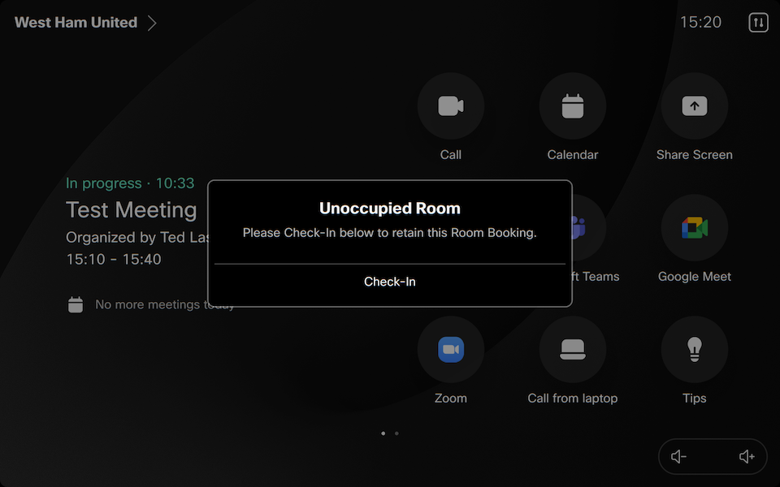
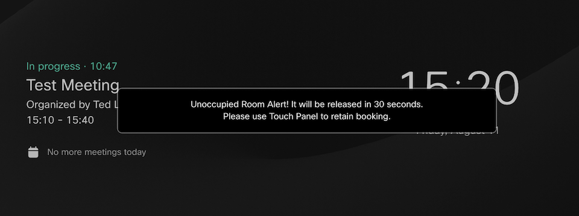

# Room Release

Macro designed to automatically release a room booking based on occupancy metrics from the Cisco codec.

The following metrics can be used for this calculation
- People Presence (Head Detection)
- Room Ultrasound
- Sound Levels
- Active Call
- Presentation Sharing
- UI Interaction

If the room is unable to detect presence this macro will wait 5 minutes before declaring the room unoccupied, and will present a dialog on the Touch Panel to initiate a Check In.
This prompt, along with playing an announcement tone, will display for 60 seconds before the booking will be declined and removed from the device.

Note: there is new a new parameter (`initialReleaseDelay`) allowing you to define an initial delay (from booking start) before invoking the countdown and releasing the room.

Additionally, there is built in functionality to ignore the release of larger bookings (duration adjustable), such as all day events which may not start on time.

Example Screenshots -

# Macro Process Flow
- Booking start time is reached or macro is restarted (and there is an active booking)
- The meeting is processed to determine duration, calculate the initial delay and is marked as active.
- If the meeting is longer than `ignoreLongerThan` duration, no further action is taken.
- Initial occupancy data is retrieved from the Codec and processed to determine current room status. 
- Based on occupied/empty status from the processing of metrics, the appropriate timestamp (last empty or full) is recorded which will are used to track room status
- Once a booking is marked active, the subscriptions for occupancy metrics are processed when there are changes detected (presence, sound, active call, etc.)
- When metrics changes are detected, the value for the affected metric is updated. If the metric is enabled, then the occupancy metrics are reprocessed.
- To ensure accurate occupancy and timestamps are kept, at the `periodicInterval`, new occupancy metrics are retrieved from the device and reprocessed.
- A room is considered empty if the current timestamp exceeds the last empty timestamp combined with the value of `emptyBeforeRelease`.
- If the room is empty and the `initialReleaseDelay` time is met/exceeded, a countdown will be displayed on screen prompting a 'Check In' based on `promptDuration` length.
- During the Check In prompt, a short announcement tone will also be played every 5 seconds if `playAnnouncement` is enabled (default true).
- If pressed, the room full timestamp will be updated with the current time, and checks will continue, however if `buttonStopChecks` is enabled, no further action is taken.
- If the check in button is not pressed, and no occupancy changes are detected in the room, the booking will be declined and removed from the calendar.
- A room is considered full if the current timestamp exceeds the last full timestamp combined with the value of `consideredOccupied`.
- Once a room is considered full and `occupiedStopChecks` is enabled (default false), no further action is taken.
- Occupancy metrics will be continually processed by either status changes in the room, or based on the `periodicInterval` timer.
- Once the booking ends, it will be marked inactive and checks/updates will stop until the next meeting.

## Deployment

1. Download the Macro file and upload to your Webex device.
2. Update the Parameters to align with your environment requirements

## Debugging

The macro contains a variable used to enable debugging output into the console.

## Support

In case you've found a bug, please [open an issue on GitHub](../../../issues).

## Disclaimer

This macro is NOT guaranteed to be bug free and production quality.

## Credits

- [Unbook Empty Room](https://github.com/CiscoDevNet/roomdevices-macros-samples/tree/master/Unbook%20Empty%20Room) macro that this macro is created from
- rudferna@cisco.com, as the original author of the room release macro
