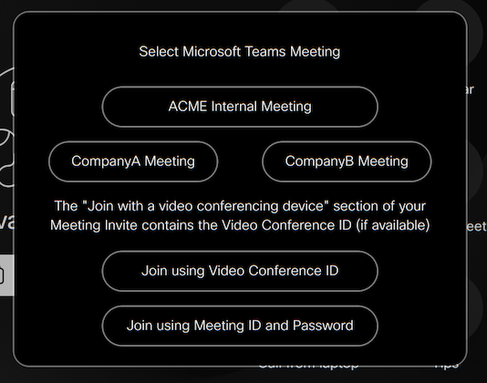

# Teams Button

Designed for customers who have an existing CVI Subscription.

Adds a Microsoft Teams button on the UI allowing you to join both CVI and WebRTC Meetings.

You can also optionally define up to 6 external cvi providers for a simplified join experience

## Deployment

1. Download the Macro file and upload to your Webex device.
2. Update the Parameters to align with your environment requirements

## Debugging

The macro contains a variable used to enable debugging output into the console.

## Support

In case you've found a bug, please [open an issue on GitHub](../../../issues).

## Disclaimer

This macro is NOT guaranteed to be bug free and production quality.

## Credits

- bomcgoni@cisco.com, as the author of the MsTeams-MultiTenant Macro that this is is derived from
- chthorpe@cisco.com and dapreti@cisco.com as consulting Engineers for the MsTeams-MultiTenant Macro